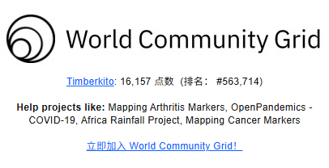

## Hi, I'm Timber :wave:

一名专注于 Android Framework 与系统应用开发的工程师，主要从事 AOSP 系统功能开发、设备适配、系统定制与稳定性优化。

### Focus

- Framework Core：熟悉 Android 启动流程、Binder 通信与系统服务开发，关注进程管理、窗口管理、包管理、权限管理、电源管理等核心机制
- System Apps：参与 SystemUI、Launcher、Settings 等系统应用开发与定制，涉及状态栏、导航栏、锁屏、通知、快捷设置、桌面和最近任务等功能
- OTA & System Update：负责 OTA 升级相关开发与问题排查，包括全量/增量升级、A/B 无缝升级、`update_engine`、Recovery、升级包制作与签名
- Telephony & Connectivity：处理 Telephony 通话、短信、移动网络、SIM 卡与 IMS 相关功能，并参与蓝牙配对连接、Profile、音频链路及 NFC 读卡、卡模拟等模块开发
- Location & GNSS：参与 Android 定位框架与 GNSS 功能开发，处理定位服务、卫星定位、辅助定位、权限策略及定位异常分析
- Platform & Stability：进行 AOSP 系统定制、资源 Overlay、权限配置和产品适配，使用 `adb`、`logcat`、`dumpsys`、`bugreport`、Perfetto 等工具定位系统启动、ANR、Crash、Watchdog、功耗与性能问题

### Tech Stack

### World Community Grid

通过 World Community Grid 贡献闲置算力，参与公共科学计算项目。

GitHub Actions 每日自动截取 WCG 官方统计卡片。
